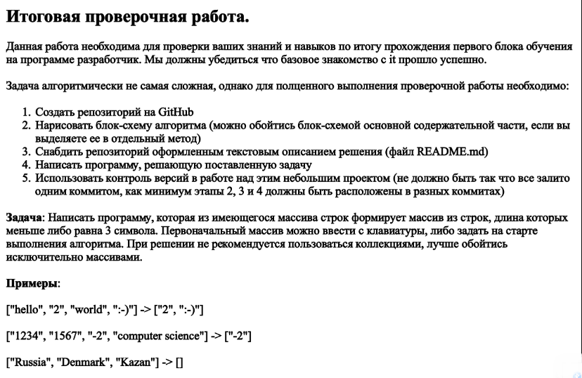

## ***Контрольная Работа***
## ***Обухова Кирилла Ивановича***
---
>### **Задача:**
Написать программу, которая из имеющегося массива строк формирует массив из строк, длина которых меньше либо равна 3 символа. Первоначальный массив можно ввести с клавиатуры, либо задать  на старте выполнения алгоритма. При решении не рекомендуется пользоваться, коллекциями, лучше обойтись исключительно массивами.
>### **Примеры:**
* ["hello","2","world",":-)"] -> ["2",":-)"]
* ["1234","1567","-2","computer science"] -> ["-2"]
* ["Russia","Denmark","Kazan"] -> []

>### **Решение:**
1. ***Создаю имеющийся массив строк как в примере***
2. ***Нахожу индексы массива с колличеством символов меньше либо равно 3***
3. ***Заношу в новый массив с длинной колличества индексов которые меньше либо равны 3, те индексы которые нашёл***
4. ***Вывожу новый массив в терминал***
